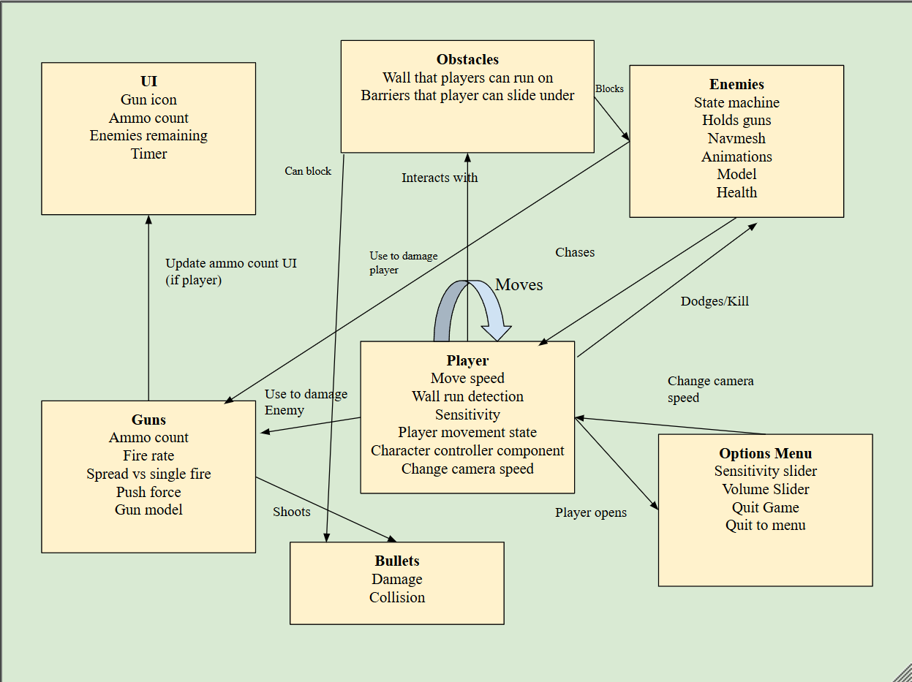
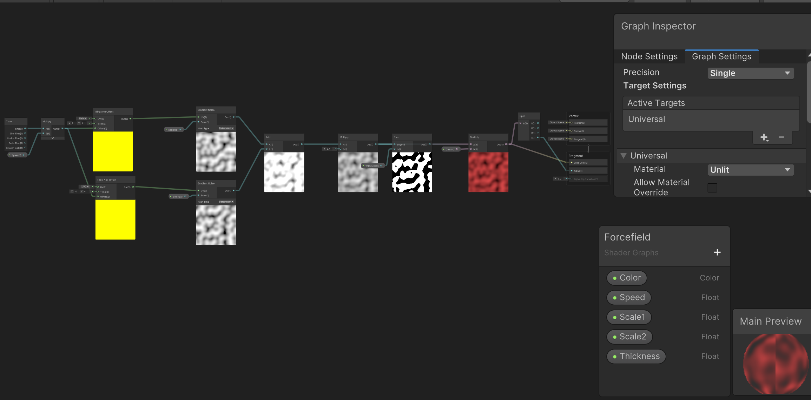

# GDIM 33 In-Class Activities

## W1

### Activity 1

https://docs.google.com/drawings/d/1omhXGpyFYs1cH8w1IvPOZ4nwgCNixbkcyZSOJxBWWaA/edit?usp=sharing

1. Some patterns that emerged during the creation of my mood board was that most of the games I put included melee combat in the hack-and-slash genre. All of these games are also PVE.
2. One of my groups mates expressed that they like playing difficult games and time management games. We are alike in the sense that we both desire intensity in games rather than calm, cozy games.
3. My table's TA expressed that their current favorite game was Baldur's Gate 3, which is also a game that I am currently enjoying. Our tastes are similar in the way that we both like playing non-competitive games. Although we both dabble in competitive games, we would rather spend our time playing single player games like Tomb Raider and Prince of Persia.

### Activity 2

### W3

### Activity 1

### Activity 2
1. Having the event name a variable reduces the chances of the programmer having an error due to typing the wrong event name in the graph. Additionally, since every other graph has access to the string, the programmer can access the variable in any graph to activate the custom event.

2. I used Debug logs to track every state change to see whether the state is being entered correctly. I labeled my debug logs to "dialogue to explore" and "explore to dialogue" to track the exact game state the player is in.

3. Set cursor lock and visible is important to my vertical slice because I am making a FPS, which requires the cursor to be hidden and locked to control the camera.

4. The game state is relevant to my vertical slice as I need something to track what happens when the game starts, continues, and ends. In the start, a countdown will begin that will activate the main game state. When the player dies or completes the level, the end game state will activate.

### W4

### Activity 1

Playable parts in my vertical slice:
- Character movement: Jumping and walking.
- Core mechanics: Propel mechanic, damage, guns, shooting
- Timer
- Enemy death
- Gun animations
- Weapon Switching

Playtesters: 
- Zom
- Zoya 
- Jacob
- Noah
- Kristin
- Julie

Players do not interact with propell mechanic often. Shotgun should have more feedback behind it's shot. Add barriers for the roof. Shots spawn behind the player.

Possible adjustments: 
- add higher platforms to incentivize players to propell more. 
- Make rifle stronger. Shotguns are too strong
- Sensitivity is too high, add a slider.

### Activity 2
1. The writer can add more dialogue to this setup because all of the dialogue is managed through scriptable objects that the writers can create without worrying about the backend. In the backend, the flow of the dialogue is control automatically without having the writers interfering with internal logic.

2. The writer can only put four dialogue nodes before the layout group overflows and makes the UI look weird.

3. The regenerate nodes button is used to create nodes to access custom classes that do not derive from monobehavior or scriptable objects within the visual graph. However, new monohavior and scriptable object scripts are scraped and automatically added to be used in the visual graph.

### W5
### Activity 1
1. Set up walking animations for enemies
    - Add idle and walking animation clips in the animator
    - Create a parameter named "IsWalking" to control transitions.
    - In the EnemyManager C# script, set "IsWalking" to true if the agent's velocity magnitude is above 0.05f and false if less
    - TEST: When the enemy walks towards the player, the "IsWalking" parameter in the animator should be set to true

2. Set up transitions between walking states 
    - Hook up Idle -> Walk and Walk <- Idle
        - Idle -> Walk: Set exit time to 0 and transition time to 0.25. In the transition, add the parameter so the animation activates when IsWalking == true.
        - Walk -> Idle: Set exit time to 0 and transition time to 0.25.  In the transition, add the parameter so the animation activates when IsWalking == false.
        - TEST: When the animator parameter "IsWalking" is true, the enemy should smoothly transition from idle -> running and vice versa.

3.  Play attack animation when in range.
    - Add the attack animation to the animator
    - Set a transition from the attack to idle. Make the exit time 0.75 and the transition duration 0.25f.
    - Make a function in EnemyManager to detect the range between the enemy and the player.
    - Make a minimumDistanceToHit variable to customize the range of the attack.
    - Make a attack cooldown to make sure the enemy does not spam the animation
    - TEST: When the player is close enough and the cooldown is over, play the attack animation using animator.CrossFade("Attack", 0.1f). Reset the cooldown afterwards

### Activity 2
1. I completed setting up the walking and idle animations and linking it up to the speed of the navmesh. Additionally, I have completed the attack logic when the distance between the enemy and the player are below the minimum distance. Now, I have to set up the actual damage logic so the player dies when they are atatcked.

### W6
### Activity 1
1. 
    - I added new enemy behavior that chases the player when they get in range. I also adjusted physics and movement logic.
    - https://andy-nguyen-uci.itch.io/propellantplaytest2
    - Playtest Goal: Do the guns feel satisfying? Is the movement responsive and tight? How do players feel about the control scheme?

    Playtesting Notes: NEED sensitivity slider. Make longer levels, gameplay is fun but players desire more. Enemies feel scary when they chase the player (intended).

### Activity 2
1. The multiply setting makes the resulting color darker and less saturated because it multiplies the two colors together. The multiplication node essentially muliplies two Vector4's whose values range from 0-1 per channel. If a color has a value less than one, then the color becomes darker and less saturated.

2. If 2 alpha values are multiplied together, the result will be more translucent unless both alpha values are 1. If a value is less than one, then the result will be more transparent.

3. The shader gets the UV values from mesh vertices. This tells you where in the texture should map onto the model. 

4. I don't understand what the different blend modes mean but I find the concept very interesting and I am excited to learn more.

### W7
1. The data for the vertex color node comes from the mesh, where the its vertex information is accessed to get the color.

2. The color is blended at the edges because the three vertices that form a fragment are blended together based on the distance from each other.

3. The vertex color is less detailed than the vertex color because it is blending between the 3 vertices. With textures and UVs, the UV has the exact coordinates that is used to assign the texture to.

4. There is a spot on the shiba's rear that not following the gradient around it, indicating there is something wrong with the normals.

5. We can use a UV node to visualize where the texture is being mapped. The legs, body, and face are all colored according to the UV's which can help us check if the textures are being correctly applied.

6. The dot product returns 1 (or white) when the normal points the same direction as the light. However, we want the normals going against the light to be lit, so we have to inverse the product.

7. Since we want the fire effect to be brighter, we add the color values instead of multiplying it, which makes it darker.

### W8

### Activity 1
1. I added enemy attacks and a death state. Additionally, I made a brand new level where players need to utilize the game's propelling mechanic to jump over a wall.

2. [https://andy-nguyen-uci.itch.io/propellant-milestone-2](Link to itch) 

3. PLAYTEST GOALS AND NOTES
    - Does the death state communicate well to the player? No really, the camera shakes violently
    - Do players know to scale the wall with their gun? Yes people naturally tend to go over the wall?
    - Do the enemies blend too much with the environment? No, the enemies are fine.

### Activity 2
1. The stencil buffer defaults all the values of the Shiba to 1 since it is on the outline layer. Then, the outline shader compares the stencil value and checks that it is equal to 1. If not, the outline draws.

2. The dog is being drawn twice since the shader still draws every outline pixel on the shiba despite the shiba being over it.

3. If we multiplied the results of all the lighting then we would also be including the black pixels in the lighting meaning the some of colors will be blacked out. We add the colors to overlay the lighting over each other.

4. Changing the layer of the shiba to Outline draws the shader since the setting in the renderer only draws to object with the outline shader.

### W9

### Activity 1

Game: Pyre

1. Dialogue boxes slowly fading in with fire. 
    - Use a simple noise to reference the alphas. Add an alpha clip threshold to the material. Overtime, animate the alpha clip threshold using time to slowly decrease the threshold down to 0, fully exposing the image. Then, I can use a fresnel effect to add the glowing effect to the borders.
    - How to apply in gameplay: Reset the time duration on the material to play the fading in animation.

2. Motion blur when zooming in.
    - Get the distance from the middle of the screen to the borders. Borders of the screen get darker and middle of the screen is clear. Additionally, use a vertex shader to stretch the screen outwards.
    - How to apply in gameplay: Set the zoom in duration when the player interacts with the item, resetting the effect.

### Activity 2

1. This shader graph is used to make a barrier effect it scrolls two textures (simple noise) against each other to create a force field like effect.

2. I made a fireball shader with a Fresnel effect but I did not know how to change the color of the inside. I had to use a one minus mode to invert the colors and multiply that result with another color. Then, I would add the inner and outer colors to create a fireball effect.

### W9 

### Activity 1

(itch link)[https://andy-nguyen-uci.itch.io/gdim-playtest-final]
New additions: New weapon RAILGUN and enemies that throw projectiles

Playtesting goals: Do players like shooting the railgun and the enemies that throw projectiles.

Playtesting Notes
    - Players die way too quickly
    - Fireballs are too quick
    - the controls are not intuitive - controls are not being read
    - need to add more indication that players can jump over wall
    - players walk towards wall not knowing that it is a barrier    

### Activity 2

When diagramming a project, it is difficult to account for every mechanic and detail needed to engineer the requirements. That is why it is important to update the diagram frequently to keep track of what and how you want to implement a feature. To make this a easier process, I need to figure out how I want my game to look like in the end and build up from there. This gives a good idea of how much time it will take to make a feature and how big the scope is.

### Activity 3
I added a health stat and a heath bar so players do not die in one hit. I also added a trailing health color to show players how much health they lost.

